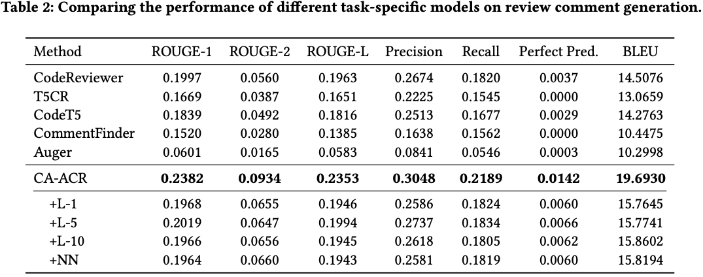
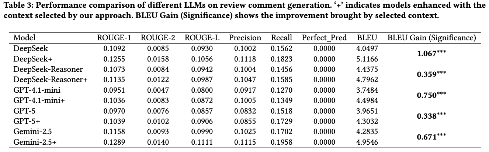
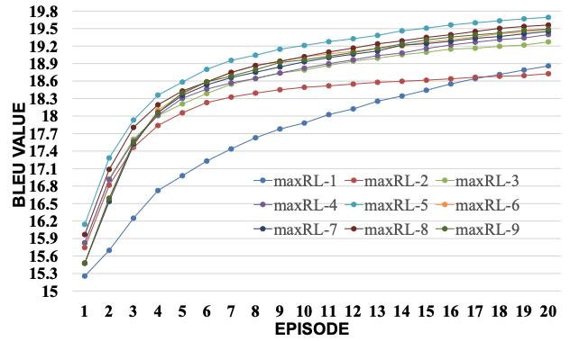

# Description
This repository is responsible for implementing the paper submitted to WWW 2026, "CA-ACR: Context-Aware Automated Code Review via Graph-Based Reinforcement Learning" 

## Task:
We aim to develop a context-aware automated code review tool.  By analyzing the code and its contextual information in OSS, this tool enhances the efficiency and accuracy of code reviews, helping developers quickly identify potential issues and improvement suggestions. 

## Folder Structure
```
context-aware-automated-code-review/
│
├── RQ1/                   # Source code directory for RQ1: Automated Comment Generation on task-Specific Models
│   ├── main.py           # Main program entry
│   ├── rl_main.py        # Code review logic
│   └── config.py         # The parameters setted in this file
│   └── AllocMethod/      # Allocation methods module including the deterministic allocation algorithms
│   ├── Database/         # Database module
│   │
│   ├── Metrics/          # Metrics module including all n-gram metrics in this paper
│   │
│   ├── Model/            # Model module including the actor-critic-based selection strategy and context-aware intergration comments generator.
│   │
│   ├── Utils/            # Utility functions module
│   │
│   ├── ShellScripts/     # Shell scripts for runing all experiments in RQ1 and RQ3.
│
├── RQ2/                  # Source code directory for RQ2: Automated Review Comment Generation on Large Language Model
│   ├── _main_3_5_.py     # Realizing the context-aware and context-free based review comments generation via commercial LLMs, including GPT, Deepseek and Gemini
│   └── utils             # Tests for utility functions
│   └── Resuls_Metrics    # Save the Test Results 
│   └── Data              # Sampled Data for Testing
│
├── RQ3/                  # Results directory for RQ3: Ablation Study on Key Parameters
│   ├── summary_result.p  # summary all ablation results for different key parameters, including maxRL and episode.
│   └── XXX.xlsx/         # All resutls for different key paramerters setted.
│
├── README.md              # Project description file
└── requirements.txt       # Project dependencies file
```

## Reproduce and Results

### RQ1: Training and Testing with rl_main.py in RQ1/:
```bash
nohup python -u rl_main.py --rlModel msg/train_NN_5 --device "cuda:4" --llm_device "cuda:5" --task_type "msg" --maxRL 5  > ./Output/rl_logs/msg/run_train_NN5.log 2>&1 &
nohup python -u rl_main.py --rlModel msg/train_NN_5 --train_eval --task_type "msg" --device "cuda:1" --llm_device "cuda:1" --maxRL 5 > run_contextAware_codediff_maxRL5_1_1.log 2>&1 &
```
### Results for RQ1:
<p align="center">
  
  
</p>

### RQ2: Testing the sampled data with _main_3_5_.py in RQ2/:
```bash
python _main_3_5_.py
```
### Results for RQ2:
<p align="center">
  
  
</p>


### RQ3: Adjusting the key parameters maxRL k in rl_main.py could answer RQ3:
```bash
nohup python -u rl_main.py --rlModel msg/train_NN_5 --train_eval --task_type "msg" --device "cuda:1" --llm_device "cuda:1" --maxRL k > run_contextAware_codediff_maxRL5_1_1.log 2>&1 &
```
### Results for RQ3:
<p align="center">
  
</p>

## Data Set
Cause the limitation of upload capacity, the data set constructed in this paper in here.